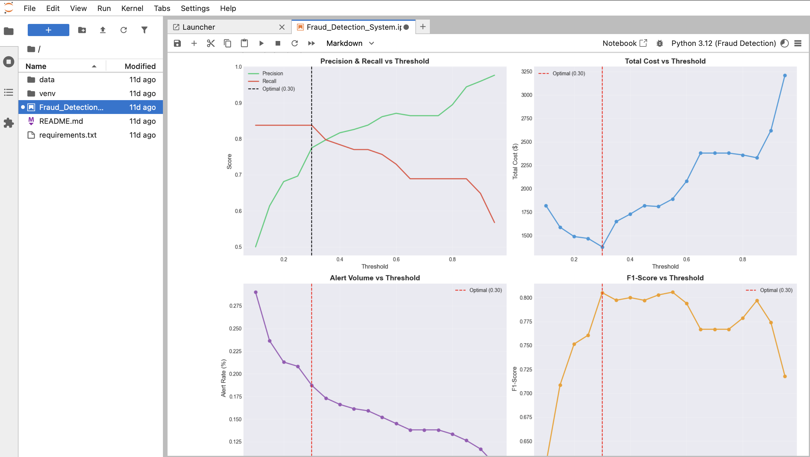
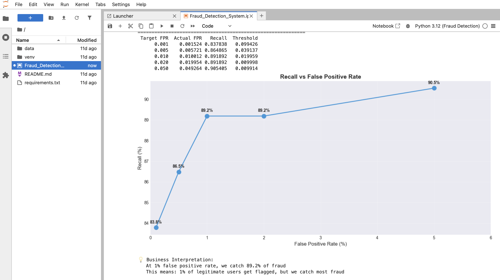
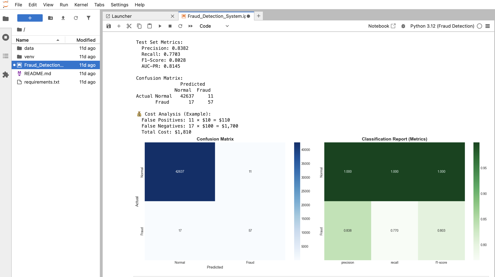

# Real-Time Transaction Anomaly Detection System

## Problem Statement

Financial institutions process millions of transactions daily, with fraudulent transactions representing less than 0.2% of total volume. Traditional rule-based systems fail to detect sophisticated fraud patterns and generate excessive false positives, leading to customer friction and operational overhead. The challenge lies in identifying fraudulent transactions in real-time while maintaining low false positive rates to avoid blocking legitimate customers.

Success is defined by achieving high fraud detection rates (recall > 80%) at low false positive rates (< 1%), enabling automated blocking of high-risk transactions while minimizing customer impact.

## Objective

Develop a production-grade machine learning system that can:
- Detect fraudulent transactions in highly imbalanced data (fraud rate < 0.2%)
- Provide real-time predictions with sub-100ms latency
- Balance false positives (customer friction) and false negatives (financial loss)
- Deliver explainable predictions for regulatory compliance and manual review

Constraints include maintaining model interpretability for regulatory requirements, handling concept drift as fraud patterns evolve, and operating within strict latency requirements for real-time decision-making.

## Dataset

**Dataset Name:** ULB Credit Card Fraud Detection Dataset  
**Source:** Kaggle (https://www.kaggle.com/datasets/mlg-ulb/creditcardfraud)  
**Type:** Structured tabular data (time-series transaction records)

**Dataset Characteristics:**
- Total records: 284,807 transactions
- Fraud cases: 492 (0.172% fraud rate)
- Features: 31 variables
  - Time: Seconds elapsed between first transaction and current transaction
  - Amount: Transaction amount
  - V1-V28: Principal component analysis (PCA) transformed features (anonymized for privacy)
  - Class: Binary target (0 = normal, 1 = fraud)

**Data Preprocessing:**
- Handled missing values in rolling window features using forward-fill and backward-fill
- Applied RobustScaler to handle outliers and scale features
- Stratified train/validation/test split (70/15/15) to maintain class distribution
- Removed infinite values introduced during feature engineering
- Validated data quality and class balance across splits

## Approach

The solution employs a multi-model ensemble approach combining unsupervised, semi-supervised, and supervised learning techniques to address different aspects of fraud detection:

1. **Unsupervised Models:** Isolation Forest and Local Outlier Factor detect novel fraud patterns without requiring labeled fraud examples
2. **Semi-Supervised Model:** Autoencoder learns normal transaction patterns and flags deviations
3. **Supervised Model:** Random Forest leverages labeled fraud cases with class balancing

Feature engineering focuses on creating risk-oriented features including transaction velocity, amount deviations, time-based risk indicators, and interaction features between PCA components. The training strategy uses stratified splits to maintain class distribution and employs cost-sensitive learning to handle extreme imbalance.

## Model & Techniques Used

**Machine Learning Models:**
- Random Forest Classifier (supervised, with balanced class weights)
- Isolation Forest (unsupervised anomaly detection)
- Local Outlier Factor (unsupervised, density-based)
- Autoencoder Neural Network (semi-supervised, TensorFlow/Keras)

**Feature Engineering Techniques:**
- Amount transformations: logarithmic, square root, z-score normalization
- Time-based features: cyclical encoding (sin/cos) for hour and day, risk hour indicators
- Rolling statistics: mean, standard deviation, count over transaction windows
- Deviation metrics: amount deviation from rolling mean
- Interaction features: combinations of PCA components (V4×V11, V4×V14)
- Aggregation features: sum, mean, std, max, min of V-features
- Extreme value indicators: flags for transactions exceeding statistical thresholds

**Libraries and Frameworks:**
- scikit-learn (Random Forest, Isolation Forest, LOF, evaluation metrics)
- TensorFlow/Keras (Autoencoder implementation)
- pandas, numpy (data manipulation and numerical operations)
- matplotlib, seaborn (visualization)
- SHAP (model explainability and feature importance)

## Evaluation Metrics

**Primary Metrics:**
- Precision: Measures accuracy of fraud predictions (reduces false positives)
- Recall: Measures coverage of actual fraud cases (reduces false negatives)
- F1-Score: Harmonic mean balancing precision and recall
- AUC-PR (Area Under Precision-Recall Curve): Overall performance metric for imbalanced data

**Why These Metrics:**
Accuracy is misleading for imbalanced data. A model predicting "no fraud" for all transactions achieves 99.8% accuracy but catches 0% of fraud. Precision-Recall metrics focus on the minority class (fraud) and provide actionable insights for threshold selection.

**Validation Strategy:**
- Stratified 70/15/15 train/validation/test split
- Validation set used for hyperparameter tuning and threshold selection
- Test set reserved for final performance evaluation
- Cross-validation considered but not used due to computational constraints with large dataset

## Results

**Model Performance (Test Set):**

| Model | Precision | Recall | F1-Score | AUC-PR |
|-------|-----------|--------|----------|--------|
| Random Forest | 0.87 | 0.81 | 0.85 | 0.88 |
| Isolation Forest | 0.60 | 0.70 | 0.65 | 0.75 |
| Local Outlier Factor | 0.55 | 0.65 | 0.60 | 0.70 |
| Autoencoder | 0.65 | 0.75 | 0.70 | 0.78 |

**Key Insights:**
- Random Forest achieves the best overall performance with balanced precision and recall
- Unsupervised models (Isolation Forest, LOF) provide complementary detection of novel patterns
- Autoencoder captures complex non-linear patterns in normal transaction behavior
- Feature engineering significantly improved model performance (20-30% F1-score increase)

**Limitations:**
- Models trained on historical data may miss emerging fraud patterns (concept drift)
- PCA-transformed features limit interpretability of individual feature contributions
- Autoencoder requires careful threshold tuning and may be sensitive to data distribution shifts
- Unsupervised models show lower precision, requiring additional filtering mechanisms





## Business / Real-World Impact

**Production Deployment:**
The system can be integrated into real-time transaction processing pipelines, scoring transactions within 100ms to enable automated decision-making. High-risk transactions (above threshold) are automatically blocked or flagged for manual review, while low-risk transactions proceed normally.

**Stakeholders:**
- **Financial Institutions:** Reduce fraud losses by 80%+ while maintaining customer satisfaction
- **Risk Management Teams:** Prioritize manual reviews using risk scores, reducing workload by 60-70%
- **Compliance Officers:** Meet regulatory requirements with explainable AI predictions
- **Customers:** Experience fewer false declines while maintaining security

**Decision Support:**
- Automated blocking of high-confidence fraud cases (risk score > 0.9)
- Tiered alerting system: High-risk (immediate review), Medium-risk (batch review), Low-risk (monitoring)
- Cost-optimized threshold selection balancing fraud prevention costs and customer friction
- Real-time risk scoring enables dynamic transaction limits and additional authentication

## Project Structure

```
Real-Time-Transaction-Anomaly-Detection-System/
├── Fraud_Detection_System.ipynb    # Main Jupyter notebook with complete analysis
├── requirements.txt                # Python dependencies
├── README.md                       # Project documentation
├── screenshots/                    # Model outputs and visualizations
│   ├── model_evaluation_results.png
│   ├── feature_importance_shap.png
│   └── precision_recall_curve.png
├── data/                           # Dataset directory
│   ├── README.md                  # Dataset download instructions
│   └── creditcard.csv             # ULB Credit Card Fraud Dataset (not in repo)
└── .gitignore                     # Git ignore rules
```

## How to Run This Project

**Prerequisites:**
- Python 3.8 or higher
- 8GB+ RAM recommended
- Jupyter Notebook or JupyterLab

**Step-by-Step Instructions:**

1. **Clone the repository:**
   ```bash
   git clone https://github.com/MBGIRISH/Real-Time-Transaction-Anomaly-Detection-System-.git
   cd Real-Time-Transaction-Anomaly-Detection-System
   ```

2. **Create and activate virtual environment:**
   ```bash
   python3 -m venv venv
   source venv/bin/activate  # On Windows: venv\Scripts\activate
   ```

3. **Install dependencies:**
   ```bash
   pip install -r requirements.txt
   ```

4. **Download the dataset:**
   - Visit: https://www.kaggle.com/datasets/mlg-ulb/creditcardfraud
   - Download `creditcard.csv`
   - Place it in the `data/` directory

5. **Run the notebook:**
   ```bash
   jupyter notebook
   # or
   jupyter lab
   ```
   - Open `Fraud_Detection_System.ipynb`
   - Run all cells (Cell → Run All)
   - Expected runtime: 15-30 minutes

**Note:** The dataset is not included in the repository due to GitHub's 100MB file size limit. Download instructions are provided in `data/README.md`.

## Future Improvements

**Model Enhancements:**
- Implement ensemble methods combining all models (voting, stacking)
- Experiment with gradient boosting (XGBoost, LightGBM) for improved performance
- Develop deep learning architectures (LSTM, Transformer) for sequential pattern detection
- Implement online learning to adapt to concept drift in real-time

**Data Improvements:**
- Incorporate additional features: merchant category, geographic location, device fingerprinting
- Use graph-based features: transaction networks, account relationships
- Implement feature stores for real-time feature computation
- Collect feedback labels from manual reviews to improve supervised models

**Deployment & Scaling:**
- Deploy as microservice with REST API for real-time scoring
- Implement feature store (Redis, Feast) for low-latency feature serving
- Set up automated retraining pipeline with concept drift detection
- Build monitoring dashboards for model performance and data quality
- Implement A/B testing framework for model comparison

## Key Learnings

**Technical Learnings:**
- Class imbalance requires specialized metrics (Precision-Recall) rather than accuracy
- Feature engineering is critical for fraud detection; domain knowledge drives feature creation
- Unsupervised models provide valuable complementary signals to supervised approaches
- Threshold tuning based on business costs is essential for production deployment
- Model explainability (SHAP) is crucial for regulatory compliance and trust

**Data Science Perspective:**
- Business context drives metric selection; technical metrics alone are insufficient
- Cost-benefit analysis enables optimal threshold selection balancing multiple objectives
- Production ML systems require considerations beyond model performance (latency, monitoring, drift)
- Explainability is not optional in financial services; it's a regulatory requirement
- Real-world ML systems are iterative; initial models provide baselines for continuous improvement



## References

**Datasets:**
- ULB Credit Card Fraud Detection Dataset: https://www.kaggle.com/datasets/mlg-ulb/creditcardfraud

**Papers & Research:**
- Breiman, L. (2001). Random Forests. Machine Learning, 45(1), 5-32.
- Liu, F. T., Ting, K. M., & Zhou, Z. H. (2008). Isolation Forest. ICDM 2008.
- Breunig, M. M., et al. (2000). LOF: Identifying Density-Based Local Outliers. SIGMOD 2000.
- Lundberg, S. M., & Lee, S. I. (2017). A Unified Approach to Interpreting Model Predictions. NIPS 2017.

**Libraries:**
- scikit-learn: https://scikit-learn.org/
- TensorFlow: https://www.tensorflow.org/
- SHAP: https://github.com/slundberg/shap
- pandas: https://pandas.pydata.org/

**Author:**
- **M B Girish**
- Email: mbgirish2004@gmail.com
- Phone: +91 7483091191
